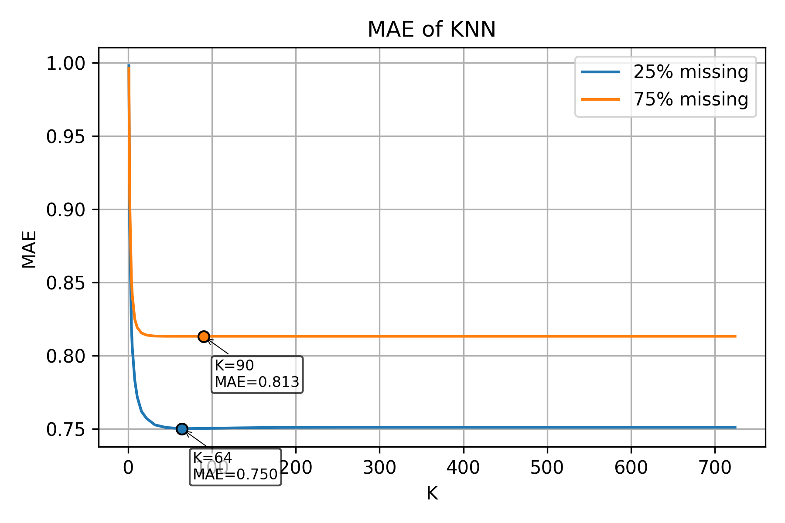
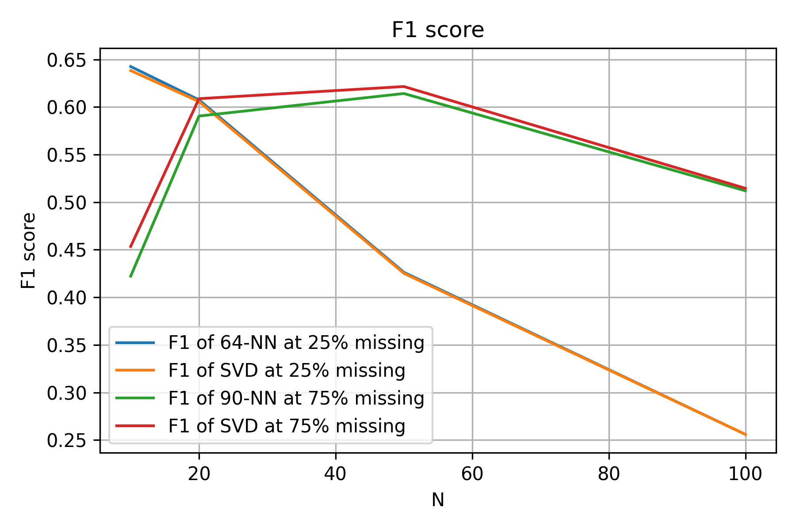
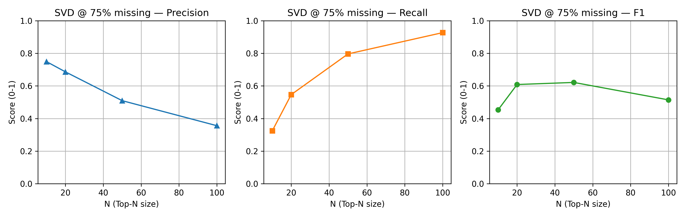

# Collaborative Filtering Experiment – K-NN vs. SVD

## 1. Overview  
This experiment investigates the performance of **User-Based Collaborative Filtering (K-NN)** and **Matrix Factorization (SVD, Funk variant)** on a given dataset.  
The objective is to:
1. Determine the optimal value of **K** that minimizes the **Mean Absolute Error (MAE)** for two levels of data sparsity (25% and 75% missing ratings).  
2. Evaluate how **SVD** mitigates sparsity compared to K-NN.  
3. Compute and compare **Precision**, **Recall**, and **F1-score** for **Top-N recommendations** (N = 10, 20, 50, 100) under both sparsity settings.

---

## 2. Results Summary

| Missing Ratings | Algorithm | Best K | MAE | Notes |
|----------------|------------|--------|------|--------|
| 25% | User-based K-NN | **64** | **0.7502** | Best-performing K for lower sparsity |
| 25% | SVD (Funk variant) | — | **0.7455** | Slightly better MAE than K-NN |
| 75% | User-based K-NN | **90** | **0.8133** | Optimal K increases as sparsity increases |
| 75% | SVD (Funk variant) | — | **0.7736** | Lower MAE than K-NN, showing robustness to sparsity |

We observe, as expected, that **SVD outperforms K-NN** in terms of MAE, especially under high sparsity (75% missing ratings). This is due to SVD's ability to learn latent factors that generalize better when data is sparse.

	
	<!-- For pandoc users: { width=60% } -->
  

By looking at the MAE–vs–K curves for K‑NN, we can observe that, with very small K, MAE is high because predictions rely on too few neighbours. As K increases, MAE drops quickly and reaches a minimum (around K≈64 for 25% missing and K≈90 for 75% missing). Beyond these optima, adding more (increasingly dissimilar) neighbours makes the prediction worse and gently increases MAE, after which the curve flattens. Under 75% missing, the whole curve shifts upward and the best K moves higher, reflecting the need for more neighbours to compensate for reduced rating overlap in sparse data.

---

## 3. Top-N Recommendation Metrics

	
	<!-- For pandoc users: { width=60% } -->

### (a) 25% Missing Ratings

| N | Algorithm | Precision | Recall | F1 |
|---|------------|------------|--------|------|
| 10 | SVD | 0.622 | 0.656 | 0.638 |
| 10 | 64-NN | 0.627 | 0.659 | 0.643 |
| 20 | SVD | 0.478 | 0.827 | 0.606 |
| 20 | 64-NN | 0.480 | 0.828 | 0.607 |
| 50 | SVD | 0.273 | 0.962 | 0.425 |
| 50 | 64-NN | 0.274 | 0.963 | 0.426 |
| 100 | SVD | 0.147 | 0.986 | 0.256 |
| 100 | 64-NN | 0.147 | 0.986 | 0.256 |

We observe that, at 25% sparsity, both SVD and K-NN perform similarly in terms of precision, recall, and F1.  
However, **SVD slightly outperforms K-NN in MAE**, indicating slightly better prediction accuracy.

---

### (b) 75% Missing Ratings

| N | Algorithm | Precision | Recall | F1 |
|---|------------|------------|--------|------|
| 10 | SVD | 0.749 | 0.325 | 0.453 |
| 10 | 90-NN | 0.705 | 0.301 | 0.422 |
| 20 | SVD | 0.686 | 0.547 | 0.609 |
| 20 | 90-NN | 0.664 | 0.532 | 0.590 |
| 50 | SVD | 0.510 | 0.796 | 0.622 |
| 50 | 90-NN | 0.502 | 0.790 | 0.614 |
| 100 | SVD | 0.356 | 0.927 | 0.515 |
| 100 | 90-NN | 0.354 | 0.925 | 0.512 |

We observe that, at 75% sparsity, **SVD consistently achieves better MAE and F1 values**, especially for moderate N (20–50).  
This indicates SVD’s advantage in sparse conditions due to latent factor modeling.

---

## 4. Discussion and Interpretation

We observe that, as data sparsity increases, the optimal **K** for K-NN also increases. This is because with fewer overlapping ratings between users, more neighbors are required for reliable similarity estimation, hence **K = 64** (25% missing) vs. **K = 90** (75% missing).  

As expected, SVD works better than K-NN especially under high sparsity. SVD generalizes better by decomposing the rating matrix into latent factors, allowing it to infer unseen preferences even with limited data. This leads to **lower MAE** in the sparse scenario.  

	
	<!-- For pandoc users: { width=75% } -->

By observing the Top-N recommendation metrics in the plot, we note a trend: as **N increases**, recall rises while precision drops. This is a standard behavior in recommender systems since including more recommendations increases the likelihood of covering relevant items but also introduces more irrelevant ones. 

Overall, the results of this experiment validate the theoretical expectations: SVD has a slight advantage over K‑NN at both sparsity levels, since these models reduce noise and are less sensitive to sparsity. K‑NN remains competitive when data density is higher, since neighbor‑based similarity works well given sufficient rating overlap.

